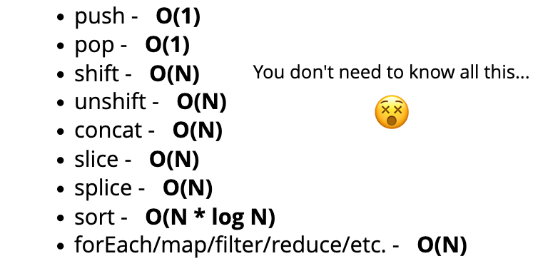

# 1. Big O Notation

## 1.1. <ins>Intro To Big O</ins>

### A. Objectives

- Motivation for needing BigO Notation

- Describe Big O Notation
- Simplify Big O Notations
- Define "time" and "space" complexities
- Evaluate "time" and "space" complexities of algorithms
- Describe what an algorithm is

### B. What's the motivation behind Big O?

>If we have multiple implementations of a function, then how do we determine which implementation is the "**best**"

### C. What is Big O?
>Big O is a way of generalizing and comparing code and it's performance to other pieces of code

### D. Why care about Big O?
- Gives us precise vocabulary to talk about how our code performs

- Useful for discussing trade-offs between different approaches
- Identify inefficiencies in our code
- Interviews

## 1.2. <ins>Timing Our Code</ins>

### A. Example

Write a function that calculates the sum of all numbers from 1 up to (and including) some number n.

##### Slower Solution:
```
function addUpTo(n) {
  let total = 0;
  for (let i = 1; i <= n; i++) {
    total += i;
  }
 return total;
}
```
##### Faster Solution:
```
function addUpTo(n) {
  return n * (n + 1) / 2;
}
```

Which code is "better"? And what does "better" mean?
- faster ?

- less memory-intensive ?
- more readable ?

Comparing time for both codes:

##### Slower Solution:
```
const t1 = performance.now();
addUpTo(1000000000);
const t2 = performance.now();
console.log(`Time Elapsed: ${(t2 - t1) / 1000} seconds.`)
```
>Time Elapsed: 0.9451825829744339 seconds.

##### Faster Solution:
```
const time1 = performance.now();
addUpTo(1000000000);
const time2 = performance.now();
console.log(`Time Elapsed: ${(time2 - time1) / 1000} seconds.`)
```
>Time Elapsed: 0.000010916948318481446 seconds.

### B. The Problem with comparing **TIME**

- Different machines will record different times
- The same machine will record different times
- For increadibly fast algorithms, speed measurements might not be precise enough

> We want to be able to be able to talk about code in general terms, without having to measure time, and that's where Big O comes into play


## 1.3. <ins>Counting Operations</ins>

### A. If not time, then what?
>Instead of counting seconds, count the <ins>**number of operations**</ins> the computer has to perform.

##### Faster Solution (Previous Example)
```
function addUpTo(n) {
  return n * (n + 1) / 2;
}
```
Counting operations for the faster solution:
1. Multiplication - `n * ...`

2. Addition - `n + ...`
3. Division - `...) / 2`
> There are 3 simple operations, regardless of the size of `n`

##### Slower Solution (Previous Example)
```
function addUpTo(n) {
  let total = 0;
  for (let i = 1; i <= n; i++) {
    total += i;
  }
  return total;
}
```
Counting operations for the slower solution:
- n additions 

  1. `total = total + i`

  2. `i++` shorthand for `i = i + 1`
- n assignments 
  1. `total = total + i`

  2. `i++` shorthand for `i = i + 1`
- 1 assignment
  1. `total = 0`

  2. `i = 1`
- n comparison
  1. `i <= n`
> Depending on what we count, the number of operations can be as low as 2n or as high as 5n+2. But regardless of the exact number, the number of operations grow roughly proportionally with n

## 1.4. <ins>Visualizing Time Complexities</ins>

### A. Performance Tracker
> Link To: [Performance Tracker](https://rithmschool.github.io/function-timer-demo/)

>
>In regards to the example above, as `n` increases, the execution time for the faster solution remains <ins>constant</ins>, whereas, for the slower solution, the time continues to increase <ins>linearly</ins>, as seen from the graph above.

## 1.5. <ins>Official Intro to Big O</ins>

### A. Big O
- Big O Notation is a way to formalize fuzzy counting

- It allows us to talk formally about how the runtime of an algorithm grows as the input grows

- We don't care about the details, only the broad trends

>We say that an algorithm is **`O(f(n))`** if the number of simple operations the computer has to do is eventually less than a constant times **`f(n)`**, as **n** increases
> - f(n) could be linear (`f(n) = n`)
> - f(n) could be quadtratic (`f(n) = n`<sup>`2`</sup>)
> - f(n) could be constant (`f(n) = 1`)
> - f(n) could be entirely different

- Big O refers to the <ins>**worst case**</ins> scenario, i.e. the upperbound of runtime.

### B. Example

#### 1. Faster Solution:

```
function addUpTo(n) {
  return n * (n + 1) / 2;
}
```
- Always 3 operations: `O(1)`
>As `n` grows there's no change in the runtime

#### 2. Slower Solution:

```
function addUpTo(n) {
  let total = 0;
  for (let i = 1; i <= n; i++) {
    total += i;
  }
  return total;
}
```
- Always 5n +2 operations: `O(n)`
>As `n` grows the number of operations is eventually bounded by a multiple of `n`, `O(n)`

#### 3. Count Up and Down:

```
function countUpAndDown(n) {

  console.log("Going Up")

  for (let i = 0; i < n; i++){
    console.log(i)
  }

  console.log("At the top. \n Going down.")

  for (let j = n - 1; j >= 0; j--){
    console.log(j)
  }

  console.log("Back Down")
}
```
- First for loop: `O(n)`
- Second for loop: `O(n)`
>You might think that Big O is `2n`, but the number of operations is (eventually) bounded by a multiple of `n`, so we simplify it to `O(n)` 

#### 4. Print All Pairs:

```
function printAllPairs(n) {
  for (let i = 0; i < n; i++){
    for (let j = 0; j < n; j++){
      console.log(i,j)
    }
  }
}
```
- First for loop: `O(n)`
- Nested loop: `O(n)`
  - if `n` = 2 -> [00, 01, 10, 11]: 4 pairs 
  - if `n` = 3 -> [00, 01, 02,...]: 9 pairs

>
>`O(n)` operation inside of an `O(n)` operation is `O(n*n)`, which is `O(n`<sup>`2`</sup>`)`, so as `n` grows, the runtime growth is <ins>quadratic</ins>.

>An `O(n)` inside an `O(n)` is `O(n`<sup>`2`</sup>`)`

## 1.6. <ins>Simplifying Big O Expressions</ins>

### A. General Rules

#### Rule 1 - **<ins>Constants Don't Matter</ins>**

>

#### Rule 2 - **<ins>Smaller Terms Don't Matter</ins>**

>

#### Rule 3 - **<ins>Arithmetic Operations are Constant</ins>**

> Arithmetic operations roughly take the same amount of time regardless the size of `n`

#### Rule 4 - **<ins>Variable Assignment is Constant</ins>**

> Variable assignment roughly takes the same amount of time regardless of the size of `n`

#### Rule 5 - **<ins>Accessing Element in an Array(by index) or Object(by key) is Constant</ins>**

> Accessing an element in an array or an object is roughly the same time regardless of `n`

#### Rule 6 - **<ins>Loop Complexity is based on length of loop times the inner complexity of the loop</ins>**
> In a loop, the complexity is the length of the loop times the complexity of whatever happens inside of the loop

### B. Examples

1. #### Log at least Five

```
function logAtLeat5(n) {
  for (let i = 0; i < Math.max(5, n); i++){
    console.log(i)
  }
}
```
>Big O is `O(n)`

2. #### Log at most Five

```
function logAtMost5(n) {
  for (let i = 0; i < Math.min(5, n); i++) {
    console.log(i);
  }
}
```
>Big O is `O(1)`

### C. Big O Complexity Chart

>

## 1.7. <ins>Space Complexity</ins>

### A. Space vs Time Complexities

##### Time Complexity
>How can we analyze the **<ins>runtime</ins>** of an algorithm as the **<ins>size of the inputs</ins>** increases
##### Space Complexity
>How much additional **<ins>memory</ins>** do we need to allocate in order to **<ins>run the code</ins>** in our algorithm

### B. What about the inputs?
>When we talk about space complexity, we are talking about **<ins>auxiallry space complexity**</ins>, which refers to the space required by the algorithm, not including the space taken up the inputs. So we don't care about the space taken by the input, since we know that as the input grows, the space needed to accomodate that input will also increase.

### C. General Rules
#### Rule 1 - **<ins>Most Primitives are Constant Space</ins>**
>Booleans, numbers, undefined, null, bigint
#### Rule 2 - **<ins>Strings are NOT Constant Space</ins>**
>Strings require `O(n)` space, where `n` is the string length
#### Rule 3 - **<ins>Arrays and Objects are generally `O(n)`</ins>**
>Reference types are generally `O(n)`, where `n` is the length (for arrays) or the number of keys (for objects)

### D. Example
1. Sum
>
> No matter the size of the input, the space taken up is constant, therefore, Big O is `O(1)`

2. Double
>
> As the input grows, the newArr grows directly in proportion to it, therefore, Big O is `O(n)`


## 1.8. <ins>Logs and Section Recap</ins>
>Sometimes Big O expressions involve more complex mathematical expressions, such as logarithms

### A. What's LOG?
>Logorithm is the inverse of exponentiation
>
>Logarthim isn't always base 2, but we only care about the big picture, the general trend.

### B. What does logarithm of a number mean?
>
>The logarithm of a number roughly measures the number of times you divide that number by 2 before you get a value that is **<ins>less than or equal to 1.</ins>**

### C. Logarithmic Time Complexity is GREAT!
>
> - Certain <ins>searching</ins> algorithms have logarithmic **time** complexity
> - Efficient <ins>sorting</ins> algorithms involve logarithms
> - <ins>Recursion</ins> sometimes involves logarithmic <ins>space</ins> complexity

## 1.9. <ins>Recap</ins>

> - To analyze the performance of an algorithm, we use Big O notation
> - Big O Notation can give us a high level understanding of the time or space (auxillary) complexity of an algorithm
> - Big O Notation doesn't care about precision, only about trends
> - The time and space complexity only depends on the algorithm, not the hardware used to run the algorithm


<div style="page-break-after: always;"></div>

# 2. Analyzing Performance of Arrays and Objects

## 2.1. <ins>Introduction</ins>

### A. Objectives
- Understand how arrays and objects work through the lens of `Big O`
- Explain why adding elements to the beginning of an array is costly
- Compare and contrast the runtime for arrays and objects, as well as built-in methods

## 2.2. <ins>The Big O of Objects</ins>
>
### A. When to use objects
- When you don't need order
- When you need fast access/insertion and removal.

### B. Big O of Objects

>
> - Objects are very fast.
> - **<ins>Hash maps</ins>** explain how objects work behind the scenes
> - Searching -`O(n)`, does NOT refer to searching for a KEY; rather, it refers to searching for information <ins>within the value</ins>.

### C. Big O of Object Methods
>

## 2.3. <ins>When are Arrays Slow?</ins>
>

### A. When to use Arrays
> - When you need order
> - When you need fast access/inserting and removal(sort of...)

> Arrays aren't the only ordered data structure. Sometimes, singlely/doubley linked list perform better than arrays

### B. Big O of Arrays

>
> - When you `access` an element in an array using the index, JavaScript <ins>doesn't</ins> access the element by counting up to the `n`<sup>`th`</sup> index value, and then returning the element; instead it **<ins>jumps to the index</ins>** and returns the value, which is why Big O of array access is `O(1)`.
> - `Insertion` and `Removal` depends on where you insert/remove:
>   - insert at end is `O(1)`
>   - insert at beginning is `O(N)` (requires re-indexing)
>   - remove from beginning is `O(N)` (requires re-indexing)
>   - remove from end is `O(1)`
>   - push/pop (end) <ins>FASTER</ins> than shift/unshift (beginning)
> - Searching is `O(N)`

### C. Big O of Array Operations
>

## 2.4. <ins>Recap</ins>
- Object are fast, but there's no order.
- Arrays are great when you need order and plan on inserting and removing only at the end of an array. 
- Inserting/removing from the beginning and the middle of an array will cause re-indexing of the array.

<div style="page-break-after: always;"></div>


# 3. Problem Solving Approach

## 3.1. <ins>Intro To Problem Solving</ins>

### A. Objectives
- Define what an algorithm is
- Devise a plan to solve algorithms
- Compare and contrast problem solving patterns including frequency counters, two pointer problems and divide and conquer

### B. What is an ALGORITHM?
>A **process** or **set of steps** to accomplish a certian task

### C. How do you improve?
> 1. Devise a plan for solving problems
> 2. Master common problem solving patterns

### D. Problem Solving Strategies
> 1. Understand the Problem
> 2. Explore Concrete Examples
> 3. Break It Down
> 4. Solve/Simplify
> 5. Look Back and Refactor


## 3.2. <ins>STEP 1 - Understand The Problem</ins>

### A. Understand The Problem
Before you start solving the problems, ask yourself these questions:
> 1. Can I `RESTATE` the problem in my own words?
> 2. What are the `INPUTS` that go into the problem?
> 3. What are the `OUTPUTS` that should come from the solution to the problem?
> 4. Can the `outputs` be `determined` from the `inputs`? In other words, do I have enough information to solve the problem?
> 5. How should I `LABEL` the important pieces of `data` that are part of the problem?

### B. Example

1. Write a function which takes two numbers and returns their sum.
- STEP 1: Understand The Problem
  1. Restate:
     - "implement addition"
  2. Inputs: 
     - integers?
     - floating point?
     - how large?
     - only 2 inputs? 
     - what if there's only 1 input?
  3. Outputs:
     - type of output?
  4. Output determined from Input:
     - in most cases there's enough information
     - if there's only 1 input what do we return?
  5. Labeling Important Data:
     - what matters?
     - num1, num2, sum (variable names)   


## 3.3. <ins>STEP 2 - Concrete Examples</ins>

### A. Explore Examples
Coming up with examples can help you understand the problem better and examples also provide sanity checks that your eventual solution works how it should.

> 1. Start with `Simple` Examples
> 2. Progress to More `Complex` Examples
> 3. Explore Examples with `Empty Inputs`
> 4. Explore Examples with `Invalid Inputs`

### B. Example

1. Write a function which takes in a string and returns counts of each character in the string.

- STEP 1: Understand The Problem
- STEP 2: Explore Examples
   1. Simple Examples:
      - `charCount("aaaa") => {a: 4}`
      - `charCount("hello") => {h:1, e:1, l: 2, o:1}`
        - do we count for characters not in the string? set it to 0?
   2. Complex Examples:
      - `charCount("this is Complex input #$#$231111")`
        - spaces?
        - numbers
        - special characters?
        - ignore casing? uppercase? lowercase?
   3. Empty Inputs:
        - `charCount("")`
          - what do we return?
   4. Invalid Inputs:
        - `charCount(INVALID_INPUT)`
          - input?
          - object?
          - null?


## 3.4. <ins>STEP 3 - Break It Down</ins>

### A. Write Down The Steps

>Explicitly write out the steps you need to take. This forces you to think about the code you'll write before you write it, and helps you catch any lingering coneptual issues or misunderstandings before you dive in and have to worry about details as well.

### B. Example
1. Write a function which takes in a string and returns counts of each character in the string.

- STEP 1: Understand The Problem
- STEP 2: Explore Examples
- STEP 3: Break It Down
    - Type up the skeleton of our function
    ```
    function charChount(str){
      // do something

      // return an object with keys that are lowercase alphanumeric characters in string; values should be a number that represents the total count of the characters in a string
    }
    ```
    - Futher Expand
    ```
    function charChount(str){
      // make object to return at end

      // loop over string for each character...
          // if the char is a number/letter AND key in object, add one to count

          // if the char is not number/letter AND not in object, add it and set value to 1

          // if the char is something else (space, period, etc) don't do anything

      // return object at end
    }
    ```
  >If you don't manage to solve the problem, make sure to layout your thought process in layman terms or pseudo code, and make sure you verbally talk through your process of solving the problem.


## 3.5. <ins>STEP 4 - Solve Or Simplify</ins>

### A. SIMPLIFY
> 1. `Find` the core `difficulty` in what you're trying to do
> 2. Temporarily `ignore` that difficulty
> 3. Write a `simplified` solution
> 4. Then `incorporate` that difficult back in

### B. Example
1. Write a function which takes in a string and returns counts of each character in the string.

- STEP 1: Understand The Problem
- STEP 2: Explore Examples
- STEP 3: Break It Down
- STEP 4: Solve or  Simplify
   1. Find the core difficulty:
      - difficulty looping over a string?
      - forgot which methods uppercase/lowercase characters
      - difficulty with alphanumeric values
   2. Ignore the difficulty (temporarily):
   3. Write a SIMPLIFIED solution:
        ```
          function charChount(str){
            
             // make object to return at end
             
             const result = {};

            // loop over string for each character

                IGNORE (Temporarily): 
                      // if the char is a number/letter AND key in object, add one to count
                      // if the char is not number/letter AND not in object, add it and set value to 1
                      // if the char is something else (space, period, etc) don't do anything

              for(let i = 0; i < str.length; i++){
                const char = str[i];
                if(result[char] > 0){
                  result[char] += 1;
                }
                else{
                  result[char] = 1;
                }
              }

            // return object at end 

            return result;
          }
        ```
   4. Incorporate the difficulty back in:
        - Do some research if allowed
        - Ask the interviewer for hint/suggestions after demonstrating your though process and solving a simplified solution


## 3.6. <ins>STEP 5 - Look Back and Refactor</ins>

### A. Refactoring Questions
>1. Can you check the result?
>2. Can you derive the result differently?
>3. Can you understand it at a glance?
>4. Can you use the result or method for some other problem?
>5. Can you improve the performance of your solution?
>6. Can you think of other ways to refactor?
>7. How have other people solved this problem?


## 3.7. <ins>Recap and Interview Strategies</ins>

>Steps 1 to 5 help us in devising a plan for solving problems.

<div style="page-break-after: always;"></div>

# 4. Problem Solving Patterns


## 4.1. <ins>Intro To Problem Solving Patterns</ins>

### A. Some Common Patterns

>


## 4.2. <ins>Frequency Counter Pattern</ins>

### A. Frequency Counters
>This pattern uses objects or sets to collect values/frequencies of values. This can often avoid the need for nested loops or `O(n`<sup>`2`</sup>`)`operations with array/string.
The Big O for this pattern is usually `O(n)`.

### B. EXAMPLE

1. Write a function called **same**, which accepts two arrays. The function should return true if every value in the array has it's corresponding value squared in the second array. The frequency of values must by the same.

#### Naive Solution:
```
// Big O = O(n^2)

function same(arr1, arr2) {
  let result = true;

  if (arr1.length === arr2.length) {
    for (let i = 0; i < arr1.length; i++) { //---> O(n)
      if (arr2.includes(arr1[i] ** 2)) {
        let indexToRemove = arr2.indexOf(arr1[i] ** 2); //---> O(n)
        arr2.splice(indexToRemove, 1);
      } else {
        result = false;
      }
    }
  } else {
    result = false;
  }
  return result;
}
```
>In the naive solution, there's nested loops which means Big O is `O(n`<sup>`2`</sup>`)`. If there are 1000 elements in the array, then it would take 1000*1000 = `1,000,000` iterations.

#### Refactored Solution (using `Frequency Pattern`):
```
function same(arr1, arr2){
    if(arr1.length !== arr2.length){
        return false;
    }

    let frequencyCounter1 = {}
    let frequencyCounter2 = {}
    for(let val of arr1){ ---> O(n)
        frequencyCounter1[val] = (frequencyCounter1[val] || 0) + 1
    }
    for(let val of arr2){
        frequencyCounter2[val] = (frequencyCounter2[val] || 0) + 1        
    }
    for(let key in frequencyCounter1){
        if(!(key ** 2 in frequencyCounter2)){
            return false
        }
        if(frequencyCounter2[key ** 2] !== frequencyCounter1[key]){
            return false
        }
    }
    return true
}

```
> Using 2 **<ins>separate</ins>** loops is vastly `better` than using 2 nested loops.  If there are 1000 elements in the array, then it would take 1000+1000+1000 = `3000` iterations. The Big O in this case is `O(3n)`, which simplifies to `O(n)`.

### C. ANAGRAMS

1. Given two strings, write a function to determine if the second string is an anagram of the first. An anagram is a word, phrase, or name formed by rearranging the letters of another, such as 'cinema', formed from 'iceman'.

#### Solution:
```
function validAnagram(str1, str2) {
  if (str1.length !== str2.length) {
    return false;
  }

  const str1FrequencyCount = {};
  const str2FrequencyCount = {};

  for (let i = 0; i < str1.length; i++) {
    str1FrequencyCount[str1[i]] = (str1FrequencyCount[str1[i]] || 0) + 1;
    str2FrequencyCount[str2[i]] = (str2FrequencyCount[str2[i]] || 0) + 1;
  }

  for (let key in str1FrequencyCount) {
    if (!str2FrequencyCount[key]) {
      return false;
    }

    if (str1FrequencyCount[key] !== str2FrequencyCount[key]) {
      return false;
    }
  }
  return true;
}
```
>Big O is `O(2n)`, which simplifies to `O(n)`


## 4.3. <ins>Multiple Pointers Pattern</ins>
> Creating `pointers` or values that correspond to an `index` or position and move towards the `beginning`, `end` or `middle` based on a certain `condition`. Very efficient for solving problems with `minimal space complexity` as well.

### A. EXAMPLE: sumZero
1. Write a function called `sumZero` which accepts a `sorted` array of integers. The function should find the `first` pair where the sum is 0. Return an array that includes both values that sum to zero or undefined if a pair does not exist.

#### Naive Solution:
```
// Big O time complexity:  O(n^2); nested loops
// Big O space complexity: O(1); 

function sumZero(sortedArr) {
  for (let i = 0; i < sortedArr.length; i++) { ---> //O(n)
    for (let j = i + 1; j < sortedArr.length; j++) { ---> //O(n)
      if (sortedArr[i] + sortedArr[j] === 0) {
        return [sortedArr[i], sortedArr[j]]
      }
    }
  }
}

```
> The Big O for time complexity is `O(n`<sup>`2`</sup>`)` since the naive solution uses nested loops, and for space complexity the Big O is `O(1)`.

#### Refactored Solution (using `Multiple Pointers Pattern`):
```
// Big O time complexity: O(n)
// Big O space complexity: O(1)

//refactored using multiple pointers pattern

function sumZero(sortedArr) {
  let leftPointerIndex = 0;
  let rightPointerIndex = sortedArr.length - 1;

  while (leftPointerIndex < rightPointerIndex) {

    let result = sortedArr[leftPointerIndex] + sortedArr[rightPointerIndex];
    if (result === 0) {
      return [sortedArr[leftPointerIndex], sortedArr[rightPointerIndex]]
    }
    else if (result > 0) {
      rightPointerIndex--;
    }
    else {
      leftPointerIndex++;
    }

  }
}
```
>This works because the array is `sorted`. The `Big O` for time complexity is `O(n)` and for space complexity it is `O(1)`.

### B. EXAMPLE countUiqueValues
2. Implement a function valled countUniqueValues, which accepts a sorted array, and counts the unique values in the array. There can be negative numbers in the array, but it will always be sorted.

#### Naive Solution:

```
function countUniqueValues(sortedArr) {
  if (sortedArr.length === 0) {
    return 0;
  }

  let uniqueCount = {};
  for (let value of sortedArr) {
    uniqueCount[value] = (uniqueCount[value] || 0) + 1;
  }

  return Object.keys(uniqueCount).length;
}

```
>In this naive solution, `no pointers` are used. The Big O for time complexity is `O(n)` and for space complexity, it is `O(n)` since we are using an object to store unique counts.
#### Refactored Solution (using `Multiple Pointers Pattern`):

```
//Big O space: O(1) ; unlike previous solution, now a primitive value is used to keep track of unique values


function countUniqueValues(sortedArr) {
  if (!sortedArr.length) {
    return 0;
  }
  if (sortedArr.length === 1) {
    return 1;
  }

  let firstPointerIndex = 0;
  let secondPointerIndex = 1;
  let count = 1;

  while (secondPointerIndex <= sortedArr.length - 1) {
    if (sortedArr[firstPointerIndex] === sortedArr[secondPointerIndex]) {
      secondPointerIndex++;
    } else {
      firstPointerIndex = secondPointerIndex;
      count++;
    }
  }
  return count;
}

```
> The Big O is `O(n)` for time complexity, and `O(1)` for space complexity since a primitive variable is used to store count.


## 4.4. <ins>Sliding Window Pattern</ins>
>This pattern involves creating a `window` which can either be an array or number from one position to another. Depending on a certain condition, the window either increases or closes(and a new window is created). Very useful for keeping `track` of a `subset of data` in an array/string etc.

### A. EXAMPLE: maxSubarraySum
1. Write a function called maxSubarraySum which accepts an array of integers and a number called `n`. The function should calculate the maximum sum of `n` consecutive elements in the array.

#### Naive Solution:
```// naive solution
// Big O: time complexity = O(n^2)
// Big O: space complexity

function maxSubarraySum(arr, num) {
  let max = -Infinity;
  let sum = 0;
  let lastIndex = arr.length - 1;

  if (arr.length === 0) return null;

  for (let i = 0; i <= lastIndex - num; i++) {
    for (let j = i; j < i + num; j++) {
      sum += arr[j];
    }

    if (sum > max) {
      max = sum;
    }
    sum = 0;
  }
  return max;
}

```
>In the naive solution, the Big O for time complexity is `O(n`<sup>`2`</sup>`)` since nested loops are being utilized.

#### Refactored Solution (using `Sliding Window Pattern`):
```
function maxSubarraySum(arr, num){
  let maxSum = 0;
  let tempSum = 0;
  if (arr.length < num) return null;
  for (let i = 0; i < num; i++) {
    maxSum += arr[i];
  }
  tempSum = maxSum;
  for (let i = num; i < arr.length; i++) {
    tempSum = tempSum - arr[i - num] + arr[i];
    maxSum = Math.max(maxSum, tempSum);
  }
  return maxSum;
}

```
>The Big O in this case for time complexity is `O(n)` since two separate loops are being utilized as oppose to the naive solution which uses nested loops.


## 4.5. <ins>Divide And Conquer Pattern</ins>
>This pattern involves dividing a data set into smaller chunks and then repeating a process with a subset of data. this pattern can `decrease time complexity`. Examples of divide and conquer algorithms: `quick sort, merge sort, binary search`

### A. EXAMPLE: search
1. Given a `sorted` array of integers, write a function called search, that accepts a value and returns the index where the value passed to the function is located. If the value is not found, return -1.

#### Naive Solution:
```
function search(arr, value) {
  if (!arr.includes(value)) return -1;
  for (let i = 0; i < arr.length; i++) {
    if (arr[i] === value) {
      return i;
    }
  }
}
```
> The Big O time complexity for this naive solution is `O(n)`, since `n` increases `linearly`.

#### Refactored Solution (using `Divide and Conquer Pattern`):
```
function search(arr, value) {
  let max = arr.length - 1;
  let min = 0;

  while (min <= max) {
    let middleIndex = Math.floor((max + min) / 2);

    if (arr[middleIndex] < value) {
      min = middleIndex + 1;
    } else if (arr[middleIndex] > value) {
      max = middleIndex - 1;
    } else {
      return middleIndex;
    }
  }
  return -1;
}
```
>Big O time complexity is `O(log n)`, which means that as the input size grows, the number of operations grows very slowly.

<div style="page-break-after: always;"></div>

# 5. Optional Challenges

## 5.1. <ins>Points to Note</ins>


1. Use `sort()` for multiple pointer problems
2. Use Set constructor to create Set objects that store unique values of any type
    - `Return new Set(arguments).size !== arguments.length;`
3. Multiple pointer pattern might slightly worsen time complexity but you'll see the space complexity improve significantly.

<div style="page-break-after: always;"></div>

# 6. Recursion

## 6.1. <ins>Introduction</ins>

### A. Objectives
- Define what recursion is and how it can be used
- Understand the two essential components of a recursive function
- Visualize the call stack to better debug and understand recursive function
- Use helper method recursion and pure recursion to solve more difficult problems


## 6.2. <ins>Why Use Recursion?</ins>

### A. What is recursion?

> A process (a `function` in our case) that `calls itself`.

### B. Why do I need to know this?


## 6.3. <ins>The Call Stack</ins>

>In almost all program languages, there is a built in data structure that manages what happens when functions are invoked, it's called a call stack.

### A. Call Stack

- It's a `stack` data structure - we'll talk about that later!
- Any time a function is invoked, it is placed (`pushed`)
on the `top of the call stack`
- When JavaScript sees the `return` keyword or when the `function ends`, the compiler will remove (`pop`)

### B. Why do I care?

- You're used to functions being pushed on the call stack and popped off when they are done
- When we write `recursive` functions, we `keep pushing` new functions onto the `call stack`!


## 6.4. <ins>Our First Recursive Function</ins>


## 6.5. <ins>Our Second Recursive Function</ins>


## 6.6. <ins>Writing Factorial Iteratively</ins>


## 6.7. <ins>Writing Factorial Recursively</ins>


## 6.8. <ins>Common Recursion Pitfalls</ins>


## 6.9. <ins>Helper Method Recursion</ins>


## 6.10.<ins>Pure Recursion</ins>

<div style="page-break-after: always;"></div>


