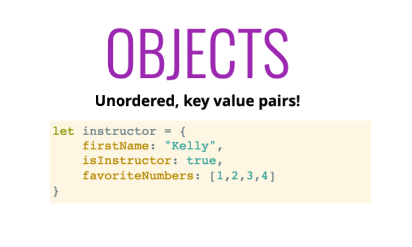
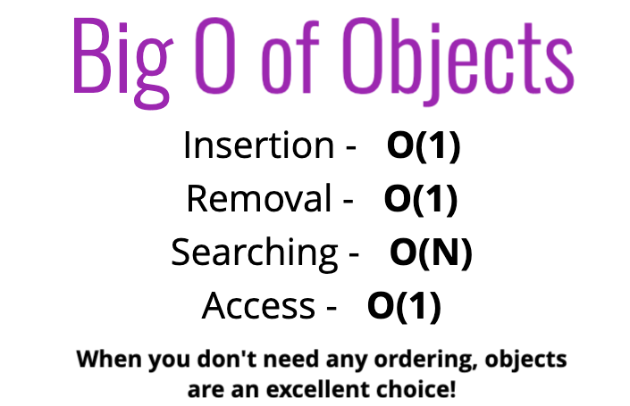
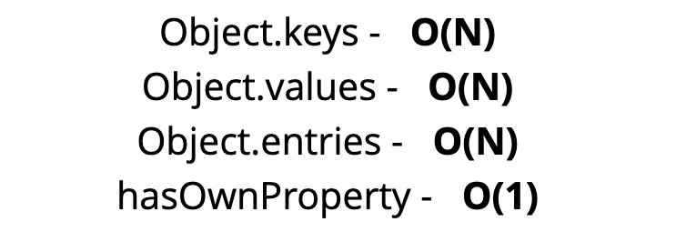
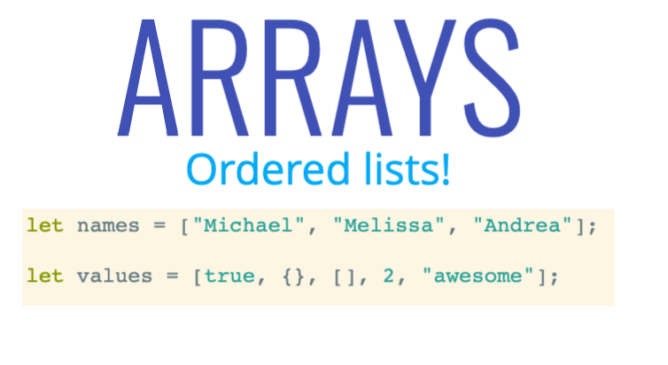
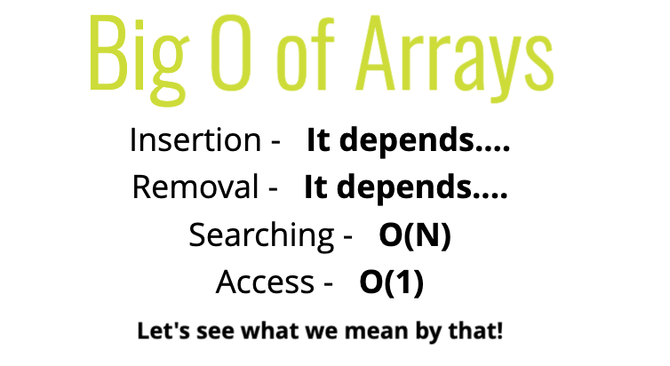
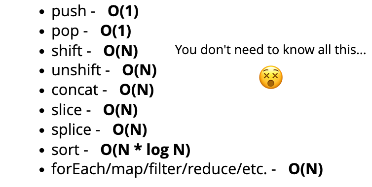

# Analyzing Performance of Arrays and Objects

## 1. Introduction

### A. Objectives
- Understand how arrays and objects work through the lens of `Big O`
- Explain why adding elements to the beginning of an array is costly
- Compare and contrast the runtime for arrays and objects, as well as built-in methods
___

## 2. The Big O of Objects
>
### When to use objects
- When you don't need order
- When you need fast access/insertion and removal.

### A. Big O of Objects

>
> - Objects are very fast.
> - **<ins>Hash maps</ins>** explain how objects work behind the scenes
> - Searching -`O(n)`, does NOT refer to searching for a KEY; rather, it refers to searching for information <ins>within the value</ins>.

### B. Big O of Object Methods
>
___
## 3. When are Arrays Slow?
>

### A. When to use Arrays
> - When you need order
> - When you need fast access/inserting and removal(sort of...)

> Arrays aren't the only ordered data structure. Sometimes, singlely/doubley linked list perform better than arrays

### B. Big O of Arrays

>
> - When you `access` an element in an array using the index, JavaScript <ins>doesn't</ins> access the element by counting up to the `n``th` index value, and then returning the element; instead it **<ins>jumps to the index</ins>** and returns the value, which is why Big O of array access is `O(1)`.
> - `Insertion` and `Removal` depends on where you insert/remove:
>   - insert at end is `O(1)`
>   - insert at beginning is `O(N)` (requires re-indexing)
>   - remove from beginning is `O(N)` (requires re-indexing)
>   - remove from end is `O(1)`
>   - push/pop (end) <ins>FASTER</ins> than shift/unshift (beginning)
> - Searching is `O(N)`

### C. Big O of Array Operations
>
___
## Recap
- Object are fast, but there's no order.
- Arrays are great when you need order and plan on inserting and removing only at the end of an array. 
- Inserting/removing from the beginning and the middle of an array will cause re-indexing of the array.
