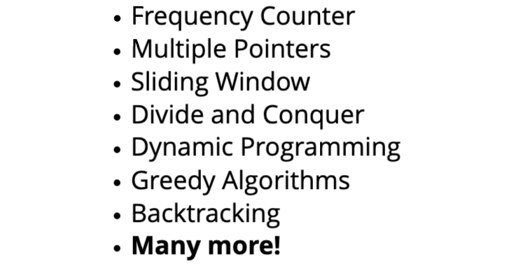

# Problem Solving Patterns


## Intro To Problem Solving Patterns

### <ins>Some Common Patterns</ins>

>
___

## Frequency Counter Pattern

### <ins>Frequency Counters</ins>
>This pattern uses objects or sets to collect values/frequencies of values. This can often avoid the need for nested loops or `O(n`<sup>`2`</sup>`)`operations with array/string.
The Big O for this pattern is usually `O(n)`.

### <ins>EXAMPLE</ins>

1. Write a function called **same**, which accepts two arrays. The function should return true if every value in the array has it's corresponding value squared in the second array. The frequency of values must by the same.

#### Naive Solution:
```
// Big O = O(n^2)

function same(arr1, arr2) {
  let result = true;

  if (arr1.length === arr2.length) {
    for (let i = 0; i < arr1.length; i++) { //---> O(n)
      if (arr2.includes(arr1[i] ** 2)) {
        let indexToRemove = arr2.indexOf(arr1[i] ** 2); //---> O(n)
        arr2.splice(indexToRemove, 1);
      } else {
        result = false;
      }
    }
  } else {
    result = false;
  }
  return result;
}
```
>In the naive solution, there's nested loops which means Big O is `O(n`<sup>`2`</sup>`)`. If there are 1000 elements in the array, then it would take 1000*1000 = `1,000,000` iterations.

#### Refactored Solution (using `Frequency Pattern`):
```
function same(arr1, arr2){
    if(arr1.length !== arr2.length){
        return false;
    }

    let frequencyCounter1 = {}
    let frequencyCounter2 = {}
    for(let val of arr1){ ---> O(n)
        frequencyCounter1[val] = (frequencyCounter1[val] || 0) + 1
    }
    for(let val of arr2){
        frequencyCounter2[val] = (frequencyCounter2[val] || 0) + 1        
    }
    for(let key in frequencyCounter1){
        if(!(key ** 2 in frequencyCounter2)){
            return false
        }
        if(frequencyCounter2[key ** 2] !== frequencyCounter1[key]){
            return false
        }
    }
    return true
}

```
> Using 2 **<ins>separate</ins>** loops is vastly `better` than using 2 nested loops.  If there are 1000 elements in the array, then it would take 1000+1000+1000 = `3000` iterations. The Big O in this case is `O(3n)`, which simplifies to `O(n)`.

### <ins>ANAGRAMS</ins>

1. Given two strings, write a function to determine if the second string is an anagram of the first. An anagram is a word, phrase, or name formed by rearranging the letters of another, such as 'cinema', formed from 'iceman'.

#### Solution:
```
function validAnagram(str1, str2) {
  if (str1.length !== str2.length) {
    return false;
  }

  const str1FrequencyCount = {};
  const str2FrequencyCount = {};

  for (let i = 0; i < str1.length; i++) {
    str1FrequencyCount[str1[i]] = (str1FrequencyCount[str1[i]] || 0) + 1;
    str2FrequencyCount[str2[i]] = (str2FrequencyCount[str2[i]] || 0) + 1;
  }

  for (let key in str1FrequencyCount) {
    if (!str2FrequencyCount[key]) {
      return false;
    }

    if (str1FrequencyCount[key] !== str2FrequencyCount[key]) {
      return false;
    }
  }
  return true;
}
```
>Big O is `O(2n)`, which simplifies to `O(n)`
___

## Multiple Pointers Pattern
> Creating `pointers` or values that correspond to an `index` or position and move towards the `beginning`, `end` or `middle` based on a certain `condition`. Very efficient for solving problems with `minimal space complexity` as well.

### <ins>EXAMPLE: sumZero</ins>
1. Write a function called `sumZero` which accepts a `sorted` array of integers. The function should find the `first` pair where the sum is 0. Return an array that includes both values that sum to zero or undefined if a pair does not exist.

#### Naive Solution:
```
// Big O time complexity:  O(n^2); nested loops
// Big O space complexity: O(1); 

function sumZero(sortedArr) {
  for (let i = 0; i < sortedArr.length; i++) { ---> //O(n)
    for (let j = i + 1; j < sortedArr.length; j++) { ---> //O(n)
      if (sortedArr[i] + sortedArr[j] === 0) {
        return [sortedArr[i], sortedArr[j]]
      }
    }
  }
}

```
> The Big O for time complexity is `O(n`<sup>`2`</sup>`)` since the naive solution uses nested loops, and for space complexity the Big O is `O(1)`.

#### Refactored Solution (using `Multiple Pointers Pattern`):
```
// Big O time complexity: O(n)
// Big O space complexity: O(1)

//refactored using multiple pointers pattern

function sumZero(sortedArr) {
  let leftPointerIndex = 0;
  let rightPointerIndex = sortedArr.length - 1;

  while (leftPointerIndex < rightPointerIndex) {

    let result = sortedArr[leftPointerIndex] + sortedArr[rightPointerIndex];
    if (result === 0) {
      return [sortedArr[leftPointerIndex], sortedArr[rightPointerIndex]]
    }
    else if (result > 0) {
      rightPointerIndex--;
    }
    else {
      leftPointerIndex++;
    }

  }
}
```
>This works because the array is `sorted`. The `Big O` for time complexity is `O(n)` and for space complexity it is `O(1)`.

### <ins>EXAMPLE countUiqueValues</ins>
2. Implement a function valled countUniqueValues, which accepts a sorted array, and counts the unique values in the array. There can be negative numbers in the array, but it will always be sorted.

#### Naive Solution:

```
function countUniqueValues(sortedArr) {
  if (sortedArr.length === 0) {
    return 0;
  }

  let uniqueCount = {};
  for (let value of sortedArr) {
    uniqueCount[value] = (uniqueCount[value] || 0) + 1;
  }

  return Object.keys(uniqueCount).length;
}

```
>In this naive solution, `no pointers` are used. The Big O for time complexity is `O(n)` and for space complexity, it is `O(n)` since we are using an object to store unique counts.
#### Refactored Solution (using `Multiple Pointers Pattern`):

```
//Big O space: O(1) ; unlike previous solution, now a primitive value is used to keep track of unique values


function countUniqueValues(sortedArr) {
  if (!sortedArr.length) {
    return 0;
  }
  if (sortedArr.length === 1) {
    return 1;
  }

  let firstPointerIndex = 0;
  let secondPointerIndex = 1;
  let count = 1;

  while (secondPointerIndex <= sortedArr.length - 1) {
    if (sortedArr[firstPointerIndex] === sortedArr[secondPointerIndex]) {
      secondPointerIndex++;
    } else {
      firstPointerIndex = secondPointerIndex;
      count++;
    }
  }
  return count;
}

```
> The Big O is `O(n)` for time complexity, and `O(1)` for space complexity since a primitive variable is used to store count.

___

## Sliding Window Pattern
>This pattern involves creating a `window` which can either be an array or number from one position to another. Depending on a certain condition, the window either increases or closes(and a new window is created). Very useful for keeping `track` of a `subset of data` in an array/string etc.

### <ins>EXAMPLE: maxSubarraySum</ins>
1. Write a function called maxSubarraySum which accepts an array of integers and a number called `n`. The function should calculate the maximum sum of `n` consecutive elements in the array.

#### Naive Solution:
```// naive solution
// Big O: time complexity = O(n^2)
// Big O: space complexity

function maxSubarraySum(arr, num) {
  let max = -Infinity;
  let sum = 0;
  let lastIndex = arr.length - 1;

  if (arr.length === 0) return null;

  for (let i = 0; i <= lastIndex - num; i++) {
    for (let j = i; j < i + num; j++) {
      sum += arr[j];
    }

    if (sum > max) {
      max = sum;
    }
    sum = 0;
  }
  return max;
}

```
>In the naive solution, the Big O for time complexity is `O(n`<sup>`2`</sup>`)` since nested loops are being utilized.

#### Refactored Solution (using `Sliding Window Pattern`):
```
function maxSubarraySum(arr, num){
  let maxSum = 0;
  let tempSum = 0;
  if (arr.length < num) return null;
  for (let i = 0; i < num; i++) {
    maxSum += arr[i];
  }
  tempSum = maxSum;
  for (let i = num; i < arr.length; i++) {
    tempSum = tempSum - arr[i - num] + arr[i];
    maxSum = Math.max(maxSum, tempSum);
  }
  return maxSum;
}

```
>The Big O in this case for time complexity is `O(n)` since two separate loops are being utilized as oppose to the naive solution which uses nested loops.
___

## Divide And Conquer Pattern
>This pattern involves dividing a data set into smaller chunks and then repeating a process with a subset of data. this pattern can `decrease time complexity`. Examples of divide and conquer algorithms: `quick sort, merge sort, binary search`

### <ins>EXAMPLE: search</ins>
1. Given a `sorted` array of integers, write a function called search, that accepts a value and returns the index where the value passed to the function is located. If the value is not found, return -1.

#### Naive Solution:
```
function search(arr, value) {
  if (!arr.includes(value)) return -1;
  for (let i = 0; i < arr.length; i++) {
    if (arr[i] === value) {
      return i;
    }
  }
}
```
> The Big O time complexity for this naive solution is `O(n)`, since `n` increases `linearly`.

#### Refactored Solution (using `Divide and Conquer Pattern`):
```
function search(arr, value) {
  let max = arr.length - 1;
  let min = 0;

  while (min <= max) {
    let middleIndex = Math.floor((max + min) / 2);

    if (arr[middleIndex] < value) {
      min = middleIndex + 1;
    } else if (arr[middleIndex] > value) {
      max = middleIndex - 1;
    } else {
      return middleIndex;
    }
  }
  return -1;
}
```
>Big O time complexity is `O(log n)`, which means that as the input size grows, the number of operations grows very slowly.